# Overview

Lydia Doe, a Belgian resident, recently inherited four properties located in Ames, Iowa, USA. Although she is knowledgeable about real estate markets in her home country, she recognizes that property valuation principles may differ significantly in the American Midwest. To avoid inaccurate estimations and ensure profitable sales, Lydia seeks a data-driven approach to determine the market value of her new assets.

This project is developed to support Lydia in:

Accurately estimating the sales price of the four inherited homes.

Gaining insights into which house attributes most strongly affect pricing in Ames.

Building a flexible and user-friendly web application capable of predicting house prices based on input features for any property in Ames, Iowa.

## Dataset Content

* The dataset is sourced from [Kaggle](https://www.kaggle.com/codeinstitute/housing-prices-data). We then created a fictitious user story where predictive analytics can be applied in a real project in the workplace.
* The dataset has almost 1.5 thousand rows and represents housing records from Ames, Iowa, indicating house profile (Floor Area, Basement, Garage, Kitchen, Lot, Porch, Wood Deck, Year Built) and its respective sale price for houses built between 1872 and 2010.

|Variable|Meaning|Units|
|:----|:----|:----|
|1stFlrSF|First Floor square feet|334 - 4692|
|2ndFlrSF|Second-floor square feet|0 - 2065|
|BedroomAbvGr|Bedrooms above grade (does NOT include basement bedrooms)|0 - 8|
|BsmtExposure|Refers to walkout or garden level walls|Gd: Good Exposure; Av: Average Exposure; Mn: Minimum Exposure; No: No Exposure; None: No Basement|
|BsmtFinType1|Rating of basement finished area|GLQ: Good Living Quarters; ALQ: Average Living Quarters; BLQ: Below Average Living Quarters; Rec: Average Rec Room; LwQ: Low Quality; Unf: Unfinshed; None: No Basement|
|BsmtFinSF1|Type 1 finished square feet|0 - 5644|
|BsmtUnfSF|Unfinished square feet of basement area|0 - 2336|
|TotalBsmtSF|Total square feet of basement area|0 - 6110|
|GarageArea|Size of garage in square feet|0 - 1418|
|GarageFinish|Interior finish of the garage|Fin: Finished; RFn: Rough Finished; Unf: Unfinished; None: No Garage|
|GarageYrBlt|Year garage was built|1900 - 2010|
|GrLivArea|Above grade (ground) living area square feet|334 - 5642|
|KitchenQual|Kitchen quality|Ex: Excellent; Gd: Good; TA: Typical/Average; Fa: Fair; Po: Poor|
|LotArea| Lot size in square feet|1300 - 215245|
|LotFrontage| Linear feet of street connected to property|21 - 313|
|MasVnrArea|Masonry veneer area in square feet|0 - 1600|
|EnclosedPorch|Enclosed porch area in square feet|0 - 286|
|OpenPorchSF|Open porch area in square feet|0 - 547|
|OverallCond|Rates the overall condition of the house|10: Very Excellent; 9: Excellent; 8: Very Good; 7: Good; 6: Above Average; 5: Average; 4: Below Average; 3: Fair; 2: Poor; 1: Very Poor|
|OverallQual|Rates the overall material and finish of the house|10: Very Excellent; 9: Excellent; 8: Very Good; 7: Good; 6: Above Average; 5: Average; 4: Below Average; 3: Fair; 2: Poor; 1: Very Poor|
|WoodDeckSF|Wood deck area in square feet|0 - 736|
|YearBuilt|Original construction date|1872 - 2010|
|YearRemodAdd|Remodel date (same as construction date if no remodelling or additions)|1950 - 2010|
|SalePrice|Sale Price|34900 - 755000|

## Business Requirements

As a good friend, you are requested by your friend, who has received an inheritance from a deceased great-grandfather located in Ames, Iowa, to  help in maximising the sales price for the inherited properties.

Although your friend has an excellent understanding of property prices in her own state and residential area, she fears that basing her estimates for property worth on her current knowledge might lead to inaccurate appraisals. What makes a house desirable and valuable where she comes from might not be the same in Ames, Iowa. She found a public dataset with house prices for Ames, Iowa, and will provide you with that.

* 1 - The client is interested in discovering how the house attributes correlate with the sale price. Therefore, the client expects data visualisations of the correlated variables against the sale price to show that.
* 2 - The client is interested in predicting the house sale price from her four inherited houses and any other house in Ames, Iowa.

## Hypothesis and how to validate?

**Hypotheses 1**
We consider the price of houses to be higher if the house has had a larger surface measured sq. ft.

* A correlation study can help in investigating if this is true.

**Hypotheses 2**
We consider the price oh houses to be higher if the house was built more recently.

* A correlation study can help in investigating if this is true.

**Hypotheses 3**
We consider the house price to be higher if the house is in good condition.

* A correlation study can help in investigating if this is true.

<!-- markdownlint-disable MD033 -->

 Correlation Study Results

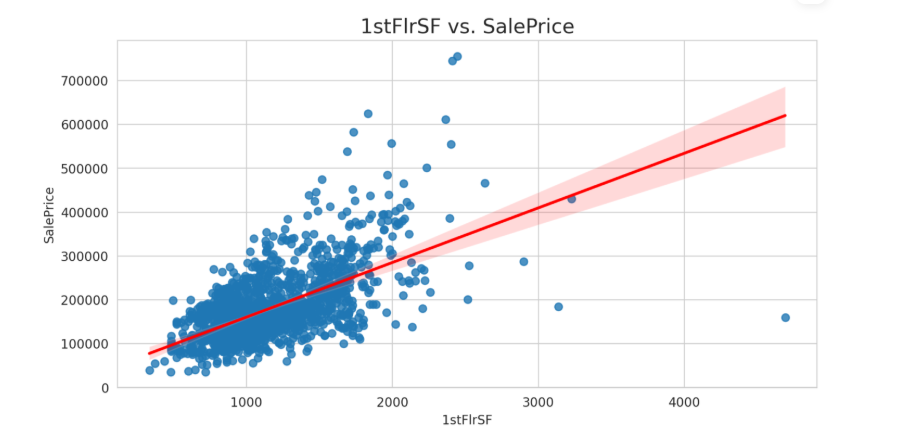

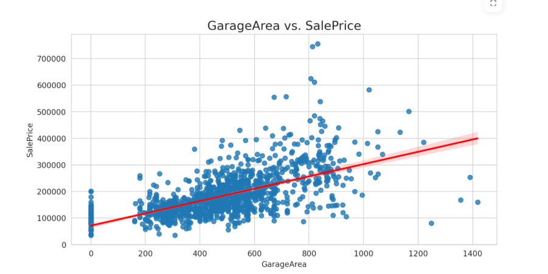

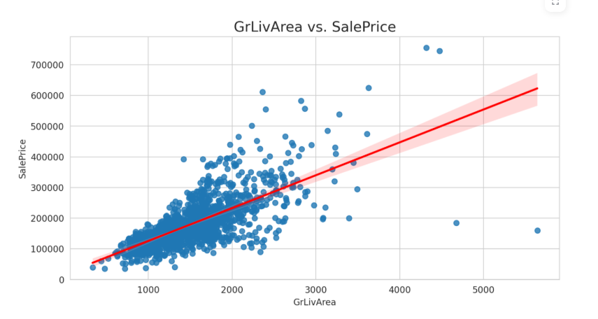

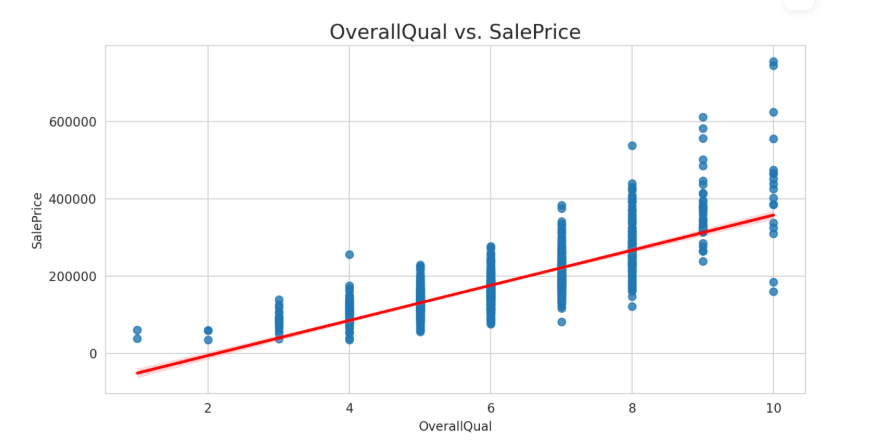

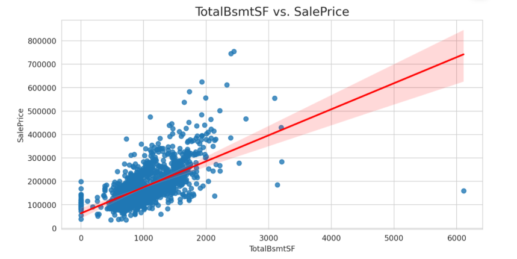

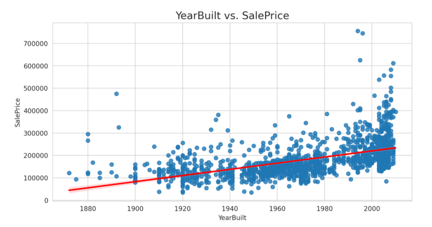

<!-- markdownlint-enable MD033 -->

## The rationale to map the business requirements to the Data Visualisations and ML tasks

**Business Requirement 1: Correlation Analysis and Data Visualisation**
The client’s primary goal is to uncover which property features most significantly influence the house sale price.

* Dataset Review and Exploration: Begin by thoroughly examining the housing dataset to understand its structure, contents, and key attributes.

* Correlation Analysis: Use both Pearson and Spearman correlation methods to evaluate the strength and direction of the relationships between various features and the target variable, "SalePrice".

* Identify Key Influential Variables: Highlight the features that show the strongest correlation with sale price. These variables will become the focus of deeper analysis.

* Visual Analysis: Leverage visualisation tools such as scatter plots, regression lines, and heatmaps to effectively display the relationships between selected features and the sale price.

* Hypothesis Testing: Use insights gained from correlation analysis and visual tools to confirm or challenge assumptions about which property characteristics have the greatest impact on pricing.

**Business Requirement 2: Predict House Prices**
The client aims to accurately predict the sale prices of residential properties in Ames, Iowa, including four inherited houses.

To achieve this, the following steps were undertaken:

1. Data Cleaning and Feature Engineering
The raw dataset was prepared by handling missing values, removing irrelevant features, and engineering new variables to enhance model performance.

2. Model Selection and Development
Several regression algorithms were explored, with ExtraTreesRegressor emerging as the most effective based on performance metrics.

3. Hyperparameter Tuning
The chosen model was further optimized using hyperparameter tuning techniques (via GridSearchCV) to enhance prediction accuracy.

4. Model Evaluation
The model's performance was assessed using metrics such as the R² score and Mean Absolute Error (MAE), ensuring reliability and accuracy.

5. House Price Prediction
The final, trained model was then used to estimate sale prices for the four inherited houses and other properties within Ames, meeting the client’s business goals.

## ML Business Case

**Key Deliverables:**

* **Data Visualisation:** Deliver clear visual representations that illustrate the relationship between various housing features and their corresponding sale prices.

* **Sale Price Estimation:** Enable accurate price predictions for the client’s inherited properties, as well as any other residential homes in Ames, Iowa.

**Analytical Approach:**

* **Traditional Data Analysis:** Apply standard statistical methods to evaluate how property attributes relate to sale prices through a detailed correlation study.

**Dashboard Development:**

* **Interactive Dashboard:** The final results will be shared through an interactive dashboard created with Streamlit, offering a user-friendly way to explore findings and predictions.

**Model Selection:**

* Given the nature of the dataset, a regression-based model will be employed to estimate house sale prices. The model will use selected housing features as input variables and produce a predicted sale price as the output.

## Dashboard Design

### Page 1: Project Overview
  
* Project Introduction
  
This project involves analyzing a dataset containing property sale information from Ames, Iowa. The goal is to understand the factors that influence house prices and develop a tool to predict the sale price of individual homes based on their attributes.

* Business Objectives

The client wishes to:

* Identify which house features are most strongly related to the final sale price.

* Use that insight to forecast the market value of four inherited properties, as well as any future houses in Ames.

### Page 2: Project Hypothesis & Validation

* Hypothesis

Certain property features — such as living area, overall quality, and basement finish — have a strong influence on house sale prices in Ames, Iowa. If these attributes are accurately captured, a predictive model should be able to estimate house prices with reasonable accuracy.

* Validation Approach

To test this, I:

* Explored correlations and predictive strength of individual features (e.g., Pearson correlation and Predictive Power Score).

* Handled missing data and engineered features where necessary.

* Trained and tested machine learning models using historical house sale data

* Hypothesis and validation page includes the list of hypotheis and the findings.

### Page 3: House Price Study

This page focuses on exploring the relationships between key variables and the target: SalePrice. It uses statistical correlation techniques to highlight which features have the strongest impact — either positive or negative — on sale price.

The correlation study uses Pearson’s correlation coefficient to quantify the linear relationship between numerical features and SalePrice. Features with values closer to +1 or –1 indicate a stronger relationship, whereas values near 0 suggest a weak or no linear relationship.

Page Includes:

Dropdown: Show a preview of the dataset
Gives users a quick look at the structure of the data after cleaning and preprocessing — useful to verify the current set of variables being analyzed.

Tickbox: Show regression plots
Displays regression line plots between top correlated features and sale price. These visualizations help users intuitively see the strength and direction of relationships.

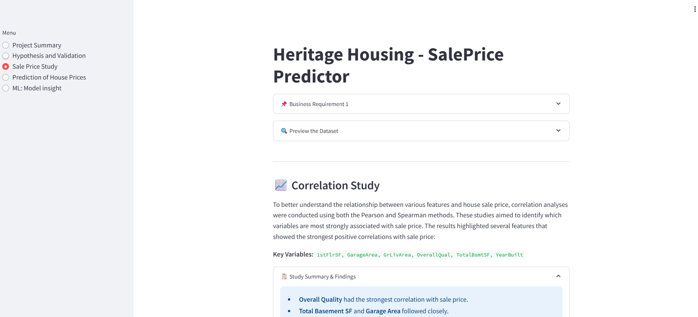

### Page 4: House Price Prediction

This page allows users to input specific details about a house and receive an estimated sale price in real time, powered by the machine learning model trained earlier in the study. It acts as a simplified, user-friendly front end for your predictive pipeline.

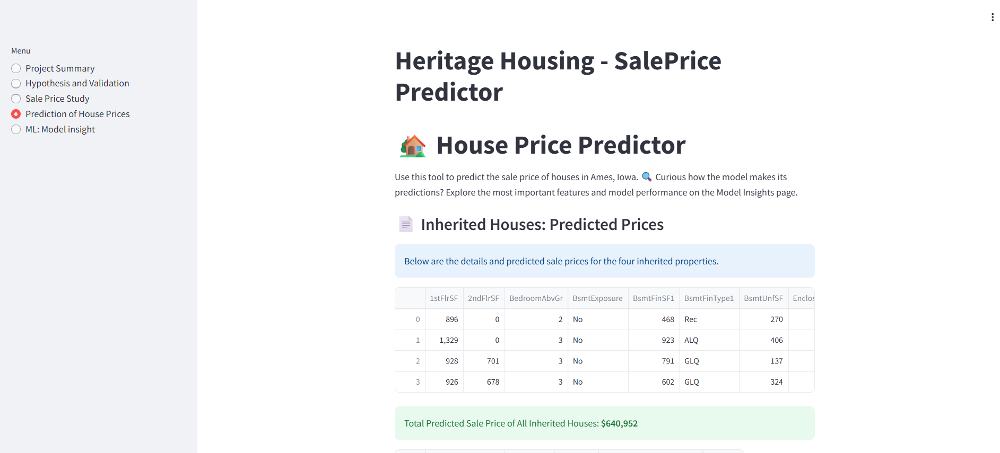

Users can manually enter or select values for important features that influence sale price — for example:

* Square footage (GrLivArea)

* Overall quality rating (OverallQual)

* Garage size

* Year built

* Basement footage (TotalBsmtSF)

### Page 5:ML Pipeline

Develop a reliable machine learning model that predicts house sale prices with a high degree of accuracy. The goal is to enable data-driven price estimation based on relevant property features.

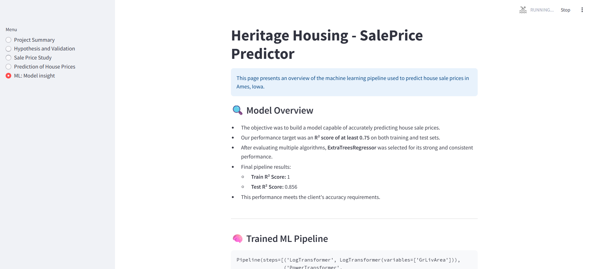

This page dives into the core machine learning process used to train and evaluate the predictive model. It provides transparency around what features were used:

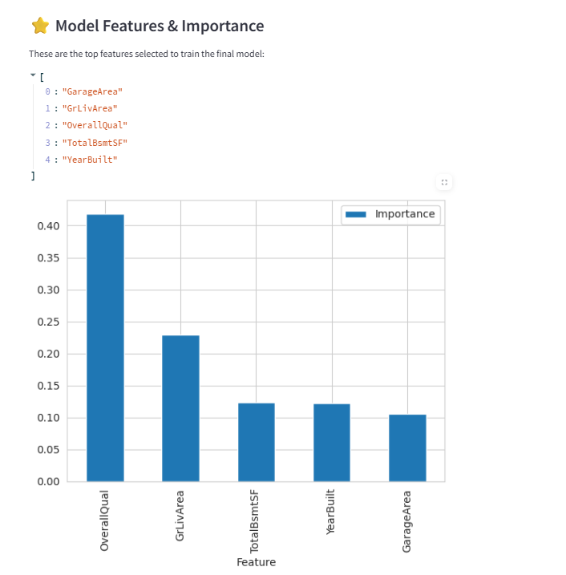

How the model was built:

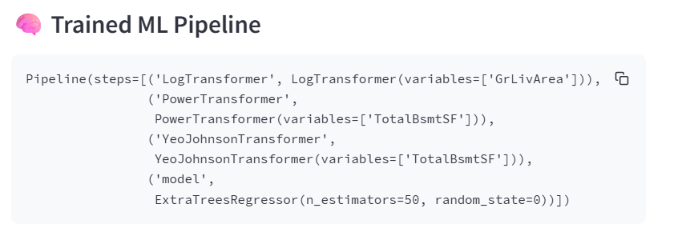

Finally the performance:

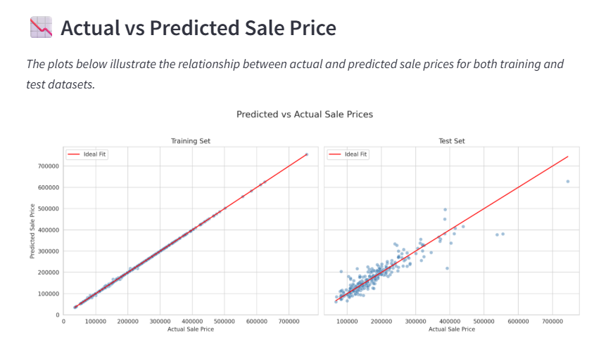

## Unfixed Bugs

### GarageYrBlt Median Imputer

There is one particular assumption made in the model that might skew data - this being GarageYrBlt having the median imputer, this can effect the model in the following:

* Loss of Temporal Meaning
The median year might not represent a realistic or contextually meaningful value.

For example, if most houses were built in 1970 and 2005, the median could be ~1990 which may not actually correspond to a real or likely garage construction year for the missing data.

* If the missing garage year is associated with no garage, then filling in a median year implies a garage exists, which can distort model accuracy.

If there was more time to develop:

 A better alternative to using the median for missing GarageYrBlt values is predictive imputation.

Unlike the median, which gives the same value to all missing entries, predictive imputation keeps the natural variation in the data. For example, if a house was built in 2005, the model might estimate the garage was also built around that time, instead of defaulting to a median like 1980.

Although this method takes a bit more time and effort, it can improve model accuracy because it keeps more of the real relationships between features.

## Deployment

The App live link is: [Deployed App](https://heritage-housing-cg-6cc4aa8a9f0f.herokuapp.com/)
The project was deployed to **Heroku** using the following steps:

1. Log in to your **Heroku** account and create a new app.
2. Go to the **Deploy** tab and choose **GitHub** as your deployment method.
3. Search for your GitHub repository and click **Connect** once it's found.
4. Select the branch you want to deploy (e.g., `main`) and click **Deploy Branch**.
5. Ensure all necessary deployment files (like `requirements.txt`, `Procfile`) are correctly set up so the build completes without errors.
6. Once deployed, click the **Open App** button to access your live application.

## Main Data Analysis and Machine Learning Libraries

### Core Python Libraries

* NumPy – Utilized in correlation studies, particularly for generating data structures that support visualizations like heatmaps.

* Pandas – Employed to load and manipulate the raw data using DataFrames, and perform various data transformation and analysis tasks.

* Matplotlib & Plotly – Used for data visualization, helping to convert complex analyses into readable and insightful plots and charts.

* Seaborn – Applied in exploratory data analysis, especially for statistical visualizations such as correlation matrices and regression plots.

* Machine Learning & Data Processing
Scikit-learn – Key library for building machine learning pipelines, implementing regression models, performing feature selection, and evaluating model performance.

* Feature-engine – Used for advanced feature engineering tasks such as missing value imputation and variable transformation, to prepare the dataset for modeling.

### Web Interface & Deployment

* Streamlit – A fast and lightweight tool used to build an interactive web app for displaying data analysis results and running predictive tools.

* Heroku – Cloud platform used to deploy and host the Streamlit web application.

### Development Environment & Tools

* Jupyter Notebook – Used for conducting initial exploratory data analysis (EDA) and training/testing machine learning models in an interactive coding environment.

* Codespaces - Integrated Development Environment (IDE) used for writing, testing, and managing the project code.

* Git – Version control tool used to manage and track changes to the project codebase throughout development.

* Here you should list the libraries you used in the project and provide example(s) of how you used these libraries.

## Credits

This project has been developed based on the knowledge and structure provided by Code Institute’s walkthrough projects, particularly the "Churnometer" (Project 2). While some elements have been directly adapted and modified from that project, considerable effort has been made to expand and customize the work to suit this new context.

Throughout the development process, I encountered technical challenges which were resolved using resources such as:

Stack Overflow, which was invaluable in helping resolve various bugs and implementation issues.

The Slack Community, where I received valuable support and guidance.

Finally, The README template provided by Code Institute, which served as the foundation for this document.

### Content

* The icons were taken from [Steamlit](https://streamlit-emoji-shortcodes-streamlit-app-gwckff.streamlit.app/)

### Acknowledgments

I would like to say thanks you to code institute for providing me with the nessary tools and lessons to be able to build this project.
